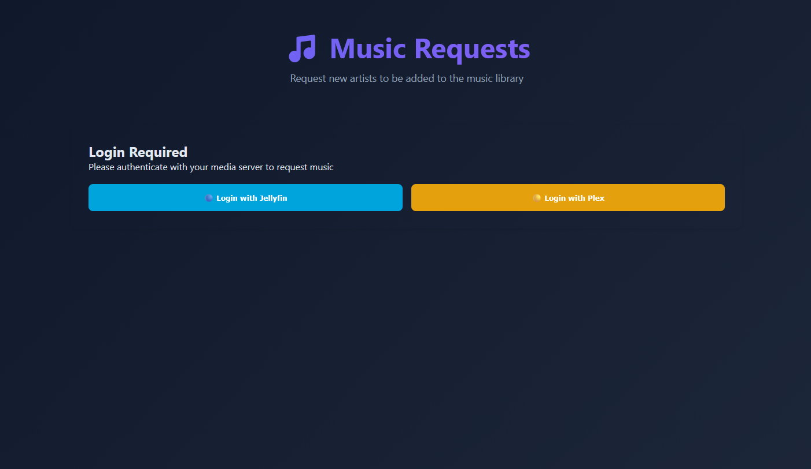

# 🎵 Blissful - Lidarr Music Downloader

A powerful microservice that automatically downloads missing music tracks for your Lidarr library using YouTube, SoundCloud, and 1000+ other sources.


---

## 📸 Screenshots & Videos

### 🎬 Demo Videos

<table>
  <tr>
    <td width="50%">
      <h4>Blissful Interface Overview</h4>
      <a href="promo/blissful.mp4">
        
      </a>
      <p><i>Complete walkthrough of the Blissful interface and features</i></p>
    </td>
    <td width="50%">
      <h4>Lidarr Integration Demo</h4>
      <a href="promo/lidarr.mp4">
        
      </a>
      <p><i>See how Blissful integrates seamlessly with Lidarr</i></p>
    </td>
  </tr>
  <tr>
    <td width="50%">
      <h4>Drag & Drop Source Priority</h4>
      <a href="promo/draganddrop.mp4">
        
      </a>
      <p><i>Easily customize download source priorities</i></p>
    </td>
    <td width="50%">
      <h4>Request System</h4>
      
      <p><i>User-friendly request page for music requests</i></p>
    </td>
  </tr>
</table>

---

## ✨ Features

- 🎵 **Automatic Music Downloads** - Download missing tracks from YouTube, SoundCloud, Bandcamp, and more
- 🔄 **Lidarr Integration** - Seamlessly integrates with your existing Lidarr setup
- 🎯 **High Quality Audio** - Configurable quality settings (up to 320kbps)
- 🔌 **Browser Userscript** - One-click downloads directly from Lidarr's web interface
- 👥 **Request System** - Let users request artists via Jellyfin/Emby/Plex authentication
- 🎛️ **Audio Processing** - Normalization, format conversion, metadata embedding
- 🗺️ **Path Mapping** - Support for remote/Docker Lidarr instances
- 🔍 **Source Priorities** - Configure preferred download sources

---

## 🚀 Quick Start

### Prerequisites

- Python 3.8 or higher
- FFmpeg (for audio conversion)
- Lidarr (running and accessible)

### Installation

```bash
# 1. Clone the repository
git clone https://github.com/angablade/blissful.git
cd blissful

# 2. Install dependencies
pip install -r requirements.txt

# 3. Start Blissful
python run.py
```

The application will start on **http://localhost:7373**

---

## ⚙️ Configuration

1. **Open the web interface:** http://localhost:7373
2. **Configure Lidarr:**
   - Go to the **Lidarr** tab
   - Enter your Lidarr URL and API key
   - Click **Test Connection**
3. **Configure Download Settings:**
   - Go to the **Settings** tab
   - Choose your preferred format (MP3, FLAC, etc.)
   - Set quality (128k - 320k)
4. **Save your settings!**

---

## 🎬 Using the Userscript

### Install the Userscript

1. Install a userscript manager:
   - [Tampermonkey](https://www.tampermonkey.net/) (Chrome, Firefox, Edge, Safari)
   - [Greasemonkey](https://www.greasespot.net/) (Firefox)

2. In Blissful, go to the **Userscript** tab
3. Click **Download Userscript**
4. Your userscript manager will open - click **Install**

### Using It

1. Go to any album page in Lidarr
2. You'll see 🎵 icons next to missing tracks
3. Click an icon to download that track
4. Blissful handles the rest automatically!

---

## 🐳 Docker

### Quick Start with Docker (Recommended)

**Official Docker Image:** `angablade/blissful:latest`

```bash
# Pull and run the official image
docker run -d \
  --name blissful \
  -p 7373:7373 \
  -v $(pwd)/config.json:/app/config.json \
  -v $(pwd)/downloads:/app/downloads \
  angablade/blissful:latest
```

### Docker Compose

```bash
# Download docker-compose.yml from the repository
# Or use this configuration:

version: '3.8'
services:
  blissful:
    image: angablade/blissful:latest
    container_name: blissful
    ports:
      - "7373:7373"
    volumes:
      - ./config.json:/app/config.json
      - ./downloads:/app/downloads
    restart: unless-stopped

# Start the container
docker-compose up -d

# View logs
docker-compose logs -f blissful
```

### Build from Source (Optional)

```bash
# Clone and build locally
git clone https://github.com/angablade/blissful.git
cd blissful

# Build the image
docker build -t blissful .

# Run the container
docker run -d -p 7373:7373 \
  -v $(pwd)/config.json:/app/config.json \
  -v $(pwd)/downloads:/app/downloads \
  --name blissful \
  blissful
```

---

## 📚 Documentation

Comprehensive documentation is available in the **Docs** tab of the web interface:

- **📋 Overview** - Introduction and features
- **🚀 Getting Started** - Detailed installation guide
- **⚙️ Configuration** - Advanced settings and options
- **🎵 Request System** - Setting up user requests
- **🔧 Troubleshooting** - Common issues and solutions

---

## 🎯 Use Cases

### Home Media Server
Download missing tracks from your music collection automatically.

### Multi-User Setup
Allow family/friends to request artists via Jellyfin/Emby authentication.

### Remote Server
Use path mapping to handle Lidarr running on a different machine or Docker.

---

## 🛠️ Technology Stack

- **Backend:** Flask (Python)
- **Download Engine:** yt-dlp
- **Audio Processing:** FFmpeg
- **Frontend:** HTML5, CSS3, JavaScript
- **Markdown Rendering:** marked.js

---

## 📁 Project Structure

```
Blissful/
├── Blissful.py           # Main application
├── extend/               # Modular managers
│   ├── config_manager.py
│   ├── download_manager.py
│   ├── lidarr_client.py
│   ├── auth_manager.py
│   └── ...
├── templates/            # HTML templates
│   └── tabs/            # Tab components
├── static/              # Static assets
│   ├── css/
│   ├── js/
│   └── lidarr-userscript.user.js
├── docs/                # Documentation
├── downloads/           # Download directory
└── config.json         # Configuration file
```

---

## ⚡ API Endpoints

### Download Track
```bash
POST /api/download-track
Content-Type: application/json

{
  "artist": "Metallica",
  "title": "Enter Sandman",
  "album": "Metallica"
}
```

### Download Album
```bash
POST /api/download-album
Content-Type: application/json

{
  "artist": "Metallica",
  "album": "Metallica",
  "tracks": [
    {"title": "Enter Sandman"},
    {"title": "Sad But True"}
  ]
}
```

### Health Check
```bash
GET /api/health
```

---

## 🔧 Configuration File

The `config.json` file stores all your settings:

```json
{
  "lidarr_url": "http://localhost:8686",
  "lidarr_api_key": "your-api-key",
  "output_format": "mp3",
  "quality": "320k",
  "enable_requests": true,
  "source_priorities": [
    "soundcloud",
    "youtube-music",
    "youtube",
    "bandcamp"
  ]
}
```

---

## 🤝 Contributing

Contributions are welcome! Here's how you can help:

1. 🐛 **Report bugs** - Open an issue with details
2. 💡 **Suggest features** - Share your ideas
3. 📝 **Improve documentation** - Help make it better
4. 🔧 **Submit pull requests** - Fix bugs or add features

---

## 🙏 Credits

**Created by:** [Angablade](https://github.com/angablade)  
**Documentation by:** Synthia (Angablade's personal AI assistant)

### Built With:
- [Flask](https://flask.palletsprojects.com/) - Web framework
- [yt-dlp](https://github.com/yt-dlp/yt-dlp) - Download engine
- [FFmpeg](https://ffmpeg.org/) - Audio conversion
- [Lidarr](https://lidarr.audio/) - Music library management

---

## 📞 Support

Need help?

- 📖 **Documentation** - Check the Docs tab in the web interface
- 🐛 **Bug Reports** - [Open an issue](https://github.com/angablade/blissful/issues)
- 💬 **Discussions** - [GitHub Discussions](https://github.com/angablade/blissful/discussions)

---

## 📄 License

This project is released into the **public domain** using [The Unlicense](https://unlicense.org/).

You can copy, modify, distribute and perform the work, even for commercial purposes, all without asking permission.

See the [UNLICENSE](UNLICENSE) file for details.

**TL;DR:** Do whatever you want with this code. No warranty, no liability, no strings attached.

